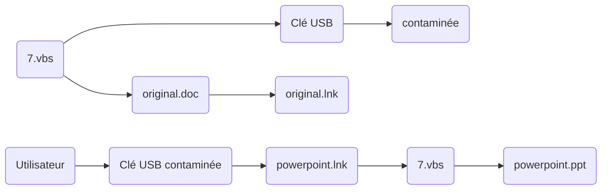

## It's a trap !
{: .center }

Qui n'a jamais eu à utiliser les ordinateurs des permanences ou bien du CDI pour finir un projet, une tâche finale ? Ou bien vérifier son Powerpoint juste avant une présentation (_voir le terminer x)_) ?

Vous vous asseyez, sortez votre clé USB puis la branchez naturellement sur le post pour commencer à travailler. Et heureusement, tout votre travail s'y trouve, ce qui vous rassure un peu. Et pourtant ! Sans le savoir, vous venez de vous faire piéger et courez un _grand danger_...

 

> Bon, j'exagère un peu, vous n'êtes pas réellement en danger du moment que vous possédez un antivirus potable et activé (à partir de windows 10, si vous avez réalisé les dernières mises à jour, vous avez windows defender). Sinon... il se peut que ce virus ne fasse qu'agrandir la colonie déjà présente sur votre pc x)
{: .prompt-info }

## Une mauvaise surprise...
{: .center }

Continuons notre petite histoire. Vous terminez ce que vous avez à faire, vous retirez la clé (après l'avoir éjectée si vous êtes précautionneux) et quittez la salle comme si de rien n'était.

Puis, l'heure arrive où vous devez rendre ou présenter votre travail. Sous le regard attentif du professeur, vous branchez votre clé sur le post. Vous entendez alors, après quelques secondes, le doux son de windows qui a détecté votre clé. Et là, patatras ! Une grosse popup rouge alarmante apparait sous vos yeux :
> "Virus détecté ! Désinfection en cours..."
{: .prompt-danger }

Vous cliquez rapidement sur l'explorateur de fichiers puis l'icone de votre clé USB. Et là, à votre grand désarroi, elle est vide, il ne reste que quelques dossiers et fichiers, mais aucun document que vous cherchez. Votre rythme cardiaque augmente, vous vous décomposez intérieurement, non seulement parce que vous venez de perdre des heures de boulot, mais aussi parce que vous allez devoir expliquer à votre professeur que votre travail a _magiquement_ disparu alors que vous l'aviez quelques minutes/heures auparavant et vous savez intérieurement que cela ressemble à une excuse bidon que même vous vous n'y croirez pas.

> Dans la plupart des cas l'antivirus des sessions professeur arrive à restaurer une partie, voir l'intégralité de vos documents. Toutefois, d'autres domestiques ne font que désinfecter la clé sans restaurer les documents, ce qui peut être embêtant si vous ne savez pas quoi chercher ^^'
{: .prompt-info }

## 7.vbs
{: .center}

Je vous présente le vilain de notre histoire: 7.vbs. Ce fichier est un vilain script [VBScript](https://fr.wikipedia.org/wiki/VBScript?msclkid=273ff222abb611ec82e9a1a9004ff849), un [Trojan](https://fr.malwarebytes.com/trojan/?msclkid=866896b2abb611ecad32443459e9761c) pour être plus précis. Toutefois, il ne peut fonctionner que sous windows (car vbscript n'est nativement compris que par windows à quelques exceptions près) donc si vous êtes sous MacOS ou Linux, vous êtes plutôt safe. 

Voici un diagramme résumant le fonctionnement de ce virus : 

_Il se peut que mermaid ne génère pas le diagramme ^^'_

**Explications**:

Lorsque vous branchez votre clé USB sur le post, le virus va cacher vos fichiers (les rendre _“invisibles”_), se copier sur la clé puis créer des fichiers raccourcis pointant sur lui-même et ayant la même apparence que vos documents. Ainsi, si vous ne faites pas attention, en pensant ouvrir vos documents, vous lancez enfaîte le script, qui va alors ouvrir votre document puis vaquer à ses occupations (aka voler vos mots de passe et autres informations confidentielles et contaminer les autres appareils branchés à votre ordinateur).

Ce virus en soit est globalement bien pensé puisqu'il peut limite ne pas s'inscrire dans le démarrage automatique windows, car c'est l'utilisateur lui-même qui va s'en occuper en lancant ses documents.

## Désinfection et récupération
{: .center }

Commençons par la procédure de récupération de vos fichiers.
Si vous êtes sous MacOS ou Linux, **"You démerdes yourself"**, google est votre ami x) A savoir que sur ces plateformes, les fichiers et répertoires sont masqués si leur nom commence par un " . " .

Concernant Windows, c'est un peu plus "compliqué".
Voici les étapes à suivre :

1. Ouvrir l'explorateur de fichier (Touche windows + E).
2. Appuyez sur "Fichier".
3. Dans le menu, sélectionnez "Modifier les options des dossiers et recherche". Vous devez ensuite avoir cette popup :

   {: width="25%" height="25%" style="border-radius:5%;" } 
4. Dans cette popup, vous allez dans "Affichage"
5. Vous scrollez ensuite dans la liste pour cocher _"Afficher les fichiers, dossiers et lecteurs cachés"_ et décocher _"Masquer les fichiers protégés du système d'exploitation"_, comme dans l'image ci-dessous:

    {: width="25%" height="25%" style="border-radius:5%;" } 
6. Enfin, vous cliquez sur _"Appliquer"_ puis sur _"OK"_.

Normalement tous vos documents sont de retour ! Après les avoir récupérés, vous pouvez refaire ces étapes pour remettre comme avant les deux options modifiées ^^

Passons maintenant ... A la désinfection de votre ordinateur !
Si par malheur vous avez lancé un de vos documents depuis un lecteur infecté sans que cela active votre antivirus, il est fort probable que votre post soit compromis. Premièrement, changez **impérativement** vos mots de passe depuis un autre appareil (lol). Suivez maintenant ces étapes afin de supprimer le script.

1. Réalisez les étapes de la récupération (afin d'afficher les fichiers masqués).
2. Appuyez sur les touches windows et R et même temps.
3. Dans la popup (image ci-dessous), écrivez `%appdata%\Microsoft\Windows\Start Menu\Programs\Startup` et faites _"Entrée"_ ou cliquez sur _"OK"_.
   
   {: width="25%" height="25%" style="border-radius: 5%;" }
4. Dans le dossier qui est apparu, supprimez tout fichier se nommant `7.vbs`, ayant l'extension `.vbs` ou bien étant de type `Fichier de script VBScript`.

    {: width="25%" height="25%" style="border-radius: 5%;" }
5. Fermez la fenêtre de l'explorateur et refaites l'étape `2`.
6. Dans la popup, écrivez maintenant `C:\ProgramData\Microsoft\Windows\Start Menu\Programs\StartUp` et faites _"Entrée"_ ou cliquez sur _"OK"_.
7. Faites l'étape `4` pour ce dossier puis fermez la fenêtre de l'explorateur.
8. Dans la barre des tâches, faites un clic droit sur le logo windows. Dans le menu qui est apparu, cliquez ensuite sur `Windows Powershell (admin)` ou sur `Terminal Windows (administrateur)`.
9. Dans la fenêtre qui est apparue, tapez ensuite `regedit.exe` suivi d'un "Entrée".
10. Dans la nouvelle fenêtre qui est apparue (image ci-dessous), cliquez sur la barre comportant `Ordinateur\` et tapez `Ordinateur\HKEY_LOCAL_MACHINE\SOFTWARE\Microsoft\Windows\CurrentVersion\Run` et faites "Entrée".
    
    {: width="25%" height="25%" style="border-radius: 5%;" }
11. Supprimez toutes les clés ayant une valeur se terminant par `.vbs`.
13. Refaites l'étape `10` en écrivant `Ordinateur\HKEY_LOCAL_MACHINE\SOFTWARE\Microsoft\Windows\CurrentVersion\RunOnce` et refaites l'étape `11`.
12. Refaites l'étape `10` en écrivant `Ordinateur\HKEY_CURRENT_USER\SOFTWARE\Microsoft\Windows\CurrentVersion\Run` et refaites l'étape `11`.
14. Refaites l'étape `10` en écrivant `Ordinateur\HKEY_CURRENT_USER\SOFTWARE\Microsoft\Windows\CurrentVersion\RunOnce` et refaites l'étape `11`.
15. Vous pouvez fermer toutes les fenêtres ouvertes durant le processus.
16. Vous pouvez réaliser les étapes de la récupération afin de remettre comme avant les deux options modifiées ^^'
17. DONE !

## Mais on fait comment pour savoir si ... ?
{: .center }

Bonne question ! Comment pouvez-vous éviter de lancer ce vilain fichier et savoir si votre clé a été compromise ? Et bien c'est très simple ! 

Vérifiez tout simplement si vos documents sont du type `Raccourci` (image ci-dessous). Si oui, ne cliquez surtout pas dessus ! Supprimez-les et procédez aux étapes de récupération ;)

{: width="25%" height="25%" style="border-radius: 5%;" }

## Mot de la fin
{: .center }

Ce virus ne date pas d'hier et était déjà présent sur les posts depuis que j'étais 4ème. Et pourtant, il fait toujours des victimes, ce qui montre une certaine efficacité de sa conception, mais aussi un manque de réaction de la part de l'établissement (usbfix, c'est bien, mais supprimer le virus, c'est mieux !).
N'hésitez pas à prevenir vos amis et à leur envoyer ce petit tuto s'ils sont infectés ^^

Ah et vous pouvez aussi laisser un petit commentaire ! Je les lirai avec plaisir !